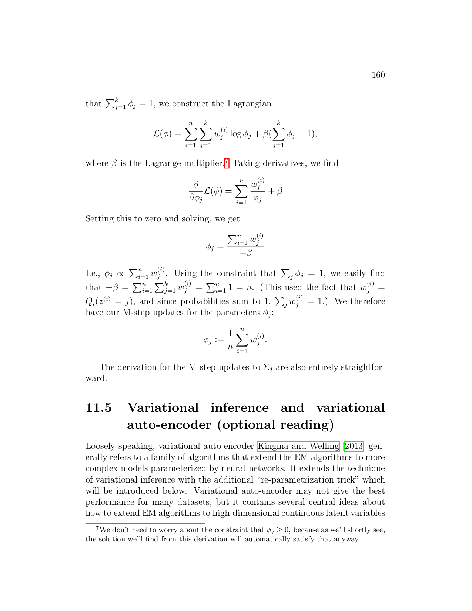

# notes-to-video

[](https://github.com/cymcymcymcym/notes-to-video)
[](https://opensource.org/licenses/MIT)
[](https://www.python.org/downloads/)
[](https://www.npmjs.com/package/notes-to-video)
[]()
[](https://claude.com/claude-code)

Turn notes (LaTeX, PDF, or plain text) into animated explainer videos in the style popularized by 3Blue1Brown — using Manim, TTS, and ffmpeg.

A [Claude Code](https://claude.com/claude-code) skill that handles the full pipeline: content extraction, narration writing with cue markers, Manim scene generation with audio-video sync, validation, rendering, and composition.

## Demo

Feed it lecture notes, get an animated explainer video. **🔊 Turn sound on** — the video has narration.

<table>
<tr>
<td width="40%" align="center"><strong>Input: CS229 Lecture Notes</strong></td>
<td width="60%" align="center"><strong>Output: Animated Explainer</strong></td>
</tr>
<tr>
<td>

<picture>
  <source media="(prefers-color-scheme: dark)" srcset="docs/cs229_vae_notes_dark.png">
  
</picture>

*Section 11.5 — Variational Auto-Encoder*
*Andrew Ng & Tengyu Ma, Stanford University*

</td>
<td>

<video src="https://github.com/user-attachments/assets/23766ba0-4e2a-444e-a165-a0c9aafd6f62" poster="docs/vae_thumbnail.png" controls style="max-height:400px; width:100%;"></video>

*🔊 Sound on. 3 min video, generated from notes in one command. [Download](https://github.com/cymcymcymcym/notes-to-video/releases/download/v1.0.0/vae_explainer_captioned.mp4)*

</td>
</tr>
</table>

## Install

**npm (recommended):**
```bash
npx notes-to-video
```

**Claude Code plugin:**
```bash
/plugin marketplace add cymcymcymcym/notes-to-video
/plugin install notes-to-video@notes-to-video-marketplace
```

**Manual:** clone this repo, copy `skills/notes-to-video/` to `~/.claude/skills/` and `video_utils/` to your project root.

## Quick Start

1. Install dependencies:
   ```bash
   pip install manim edge-tts pydub
   ```

2. In Claude Code, run:
   ```
   /notes-to-video my_notes.tex
   ```

3. Claude will:
   - Extract key concepts from your notes
   - Write a narration script with cue markers
   - Generate Manim scenes synced to the narration
   - Validate all scenes for visual issues
   - Hand you the build command

## Features

- **Notes to video pipeline** — feed in LaTeX, PDF, or plain text notes, get animated explainer videos
- **Audio-video sync** — cue-based system that synchronizes Manim animations to narration timestamps
- **CText kerning fix** — workaround for Manim's broken Pango kerning ([manim #2844](https://github.com/ManimCommunity/manim/issues/2844))
- **4 TTS backends** — Edge-TTS (free, default), MiniMax (best quality), Chatterbox (local + voice cloning), OpenAI
- **Scene validator** — catches text overlaps, out-of-bounds elements, text overflow, and line-through-text issues before rendering
- **Cross-platform** — Linux, macOS, Windows

## TTS Options

| Backend | Quality | Cost | Requirements |
|---------|---------|------|-------------|
| **Edge-TTS** (default) | Good | Free | None |
| **MiniMax** | Best | ~$0.04/min | API key |
| **Chatterbox** | Good + voice cloning | Free | NVIDIA GPU |
| **OpenAI TTS** | Good | ~$0.06/min | API key |

## How It Works

The core innovation is the **cue-based audio-video sync system**:

1. Narration is written with `{CUE_NAME}` markers at visual event points
2. TTS generates per-sentence audio and estimates cue positions by character ratio
3. Manim scenes read cue timestamps and sync animations accordingly
4. `until()` fills gaps with slow animations, `sync()` waits for exact cue times

This produces smooth, naturally-paced videos where animations fire exactly when the narrator says the relevant keyword.

## Project Structure

```
video_utils/                # Bundled library
  manim_helpers.py          # CText, colors, sync helpers
  tts_edge.py              # Edge-TTS (free, default)
  tts_minimax.py           # MiniMax TTS (cloud)
  tts_local.py             # Chatterbox + Whisper (local)
  tts_openai.py            # OpenAI TTS (cloud)
  validate_scenes.py       # Scene validator

skills/notes-to-video/
  SKILL.md                 # Claude Code skill definition
```

## License

MIT
